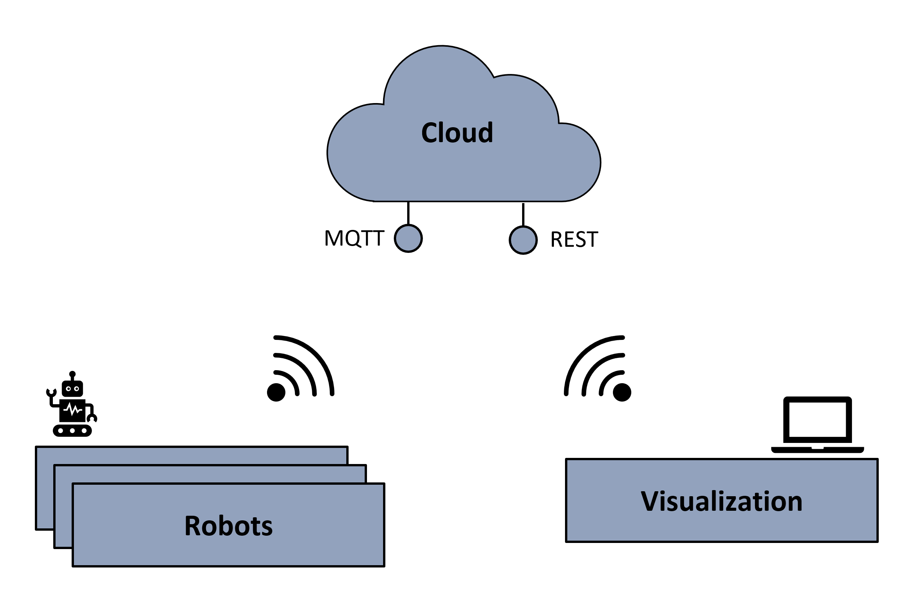
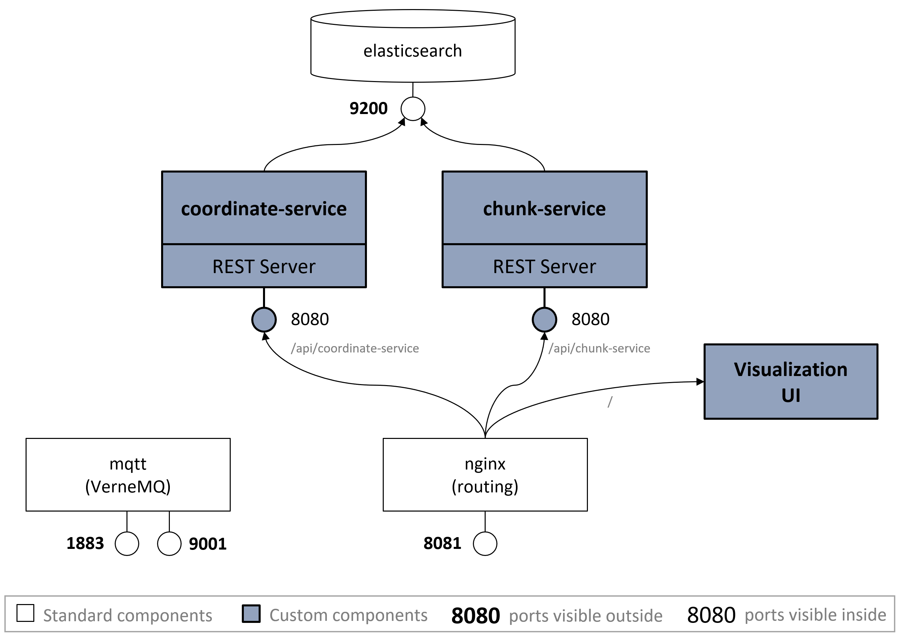

# IoT BMW Cloud

BMW requested a map service solution that enables autonomous robots to share their knowledge about their enviroment, the factory work floor. The service should also come with a visualization board that allows maintenance workers to see the current map with the robots on it and also replay the information for up to a week. 

<div align="center">
    
</div>

The cloud also serves the visualization which is a web application. This is why the visualization is included in this repository.

## What's new?

This repository is a fork of the [original cloud](https://gitlab.lrz.de/iot-bmw/cloud) repository by the previous team. The cloud has been rewritten massively. The main new features are:

* Not only storing the current map, but also a history of map changes and robot positions
* Allowing comprehensive queries to fetch map and robot information throughout the history
* Completely new visualization board developed with [Vue.js](https://vuejs.org/)

## Deployment

### Installation

1. We recommend to use any machine running Ubuntu. (We successfully used Ubuntu 14.04 and Ubuntu 18.04.)
2. Set up Docker CE for Ubuntu as described [here](https://docs.docker.com/install/linux/docker-ce/ubuntu/). (We used Docker v18.09.)
3. Recommended: Install node.js from the NodeSource repository as described [here](https://linuxize.com/post/how-to-install-node-js-on-ubuntu-18.04/#install-node-js-from-the-nodesource-repository).
4. Recommended: Open the required ports if you want to access the cloud from outside your machine.
   ```sh
    sudo ufw enable
    sudo ufw allow 8081
    sudo ufw allow 1883
    sudo ufw allow 9001
    sudo ufw allow 9200
   ```
5. Clone this repository `git clone https://gitlab.lrz.de/iot-bmw-map-service-18w/cloud.git`.
6. Recommended: add a file named `config.json` to the `visualization` folder if you want to access the visualization from outside your machine. This file should look like this
    ```json
    {
        "API_URL": "http://<IP-OF-YOUR-MACHINE>:8081",
        "MQTT_URL": "<IP-OF-YOUR-MACHINE>:9001/mqtt"
    }
    ```
    Note: The visualization uses a socket version of mqtt. This is why it uses port 9001.

### Start Up

To start up the cloud, run the following commands in the repository folder:

1. `sysctl -w vm.max_map_count=262144` (this is needed by elasticsearch)
2. `docker-compose up --build`

For convenience, you can also just run `./start.sh`

### Initialization

Although not always necessary, it is recommended to upload a map, initially. Therefore, conduct the following steps:

1. Download the `big_map.zip` from [here](https://gitlab.lrz.de/iot-bmw-map-service-18w/cloud/wikis/maps).
2. Extract this file to `./api/chunk-service/data`.
3. Open a shell and execute the following commands.
    ```sh
    cd api/chunk-service/data
    npm install
    npm run fillDB
    ```

## Usage

* Navigate with a browser to [localhost:8081](localhost:8081) or to `<IP-OF-YOUR-MACHINE>:8081` to view the visualization board.
* Navigate with a browser to [localhost:8081/controller](localhost:8081/controller) or to `<IP-OF-YOUR-MACHINE>:8081/controller` to control your own robot. **Note:** this requires a map to be uploaded to the cloud as described in the section [Initialization](#initialization).
* Interact with the API as described [here](/api/README.md).
* To delete the database, run the following commands:
  ```sh
  curl -X "DELETE" <IP-OF-YOUR-MACHINE>:9200/meta
  curl -X "DELETE" <IP-OF-YOUR-MACHINE>:9200/chunks-latest
  curl -X "DELETE" <IP-OF-YOUR-MACHINE>:9200/chunks
  curl -X "DELETE" <IP-OF-YOUR-MACHINE>:9200/coordinates-latest
  curl -X "DELETE" <IP-OF-YOUR-MACHINE>:9200/coordinates
  ```
  Alternatively, you can also use [Postman](https://www.getpostman.com/).

## Components

### Overview

The cloud comes with an mqtt broker and a database (elasticsearch). nginx serves the built visualization and the custom API services (coordinate-service and chunk-service). All these components are docker containers.

<div align="center">
    
</div>

### API

The cloud offers its API over MQTT and HTTP (REST API). HTTP is preferred for synchronous communication
while MQTT is favored for asynchronous tasks.

You can find a detailed documentation of the API [here](/api/README.md).

The API consists of the following components

* **Chunk Service:** The chunk service stores and allows to query map chunks. Chunks are uniquely identified by their `row`, `column` and `timestamp` attributes. They are stored either as Strings that are pgm B64 encoded and compressed. Or as B64 encoded png strings.

* **Co-ordinate Service:** Robots publish their current information via MQTT (topic `iot/coordinates`). The coordinate service listens to this topic and stores the information in elastic search. The data is queryable via the REST API.

### Visualization

The visualization is the main new feature in this project. It allows to review the map's history and also the robot movements. You find its documentation [here](/visualization/README.md).

## Notes

### Development

* *Run your code outside of docker:* The previous team had an architecture that made it hard to run code locally outside of docker. This is troublesome because docker build is time-devouring and proper debugging is difficult. Therefore, the architecture was changed. You can at any time stop the chunk-service and coordinate-service containers and run them with node.js outside of docker. And you can also serve a second instance of the visualization on port 8080. For more information have a look at the [API Development](/api/README.md#development) and the [Visualization Development](/visualization/README.md#development) documentation.
* *Linting:* We introduced linting which was not used by our predecessors. For more information have a look at the [API Development](/api/README.md#development) and the [Visualization Development](/visualization/README.md#development) documentation.

### Known Issues

- The replay functionality of the visualization only supports forward replay. Backward replay still has some bugs.

### Ideas for future steps

- Make the cloud scaleable. Therefore, deploy the cloud compontents in a kubernetes cluster. You may want to use the containers published in the [container registry](https://gitlab.lrz.de/iot-bmw-map-service-18w/cloud/container_registry).
- Fix the backwards functionality in the visualization.
- In the visualization slider: indicate where chunk changes occur as suggested by our [mockup](/documentation/images/visualization-mockup.PNG). **Note:** It would not be wise to download all chunk changes at once and to store them in the visualization permanently. But one could use pagination and download the `reduced` data from the chunk service (see [API documentation](/api/README.md#get-apichunk-servicechunks)). You could draw lines in an html canvas indicating the chunk changes. Do this for every REST response for pagination and discard the data afterwards.
- Let users show and hide different kinds of information in the visualization.
    * The user might want to hide the robots but show more information about each chunk, such as its last update or the update origin (robot name).
    * The user might want to show additional information for each robot, such as its battery status.
    * Display and hide the robot names.
- Make the time range of the slider more flexible. Allow the user to "zoom in" at any point in time and not only the last minute.
