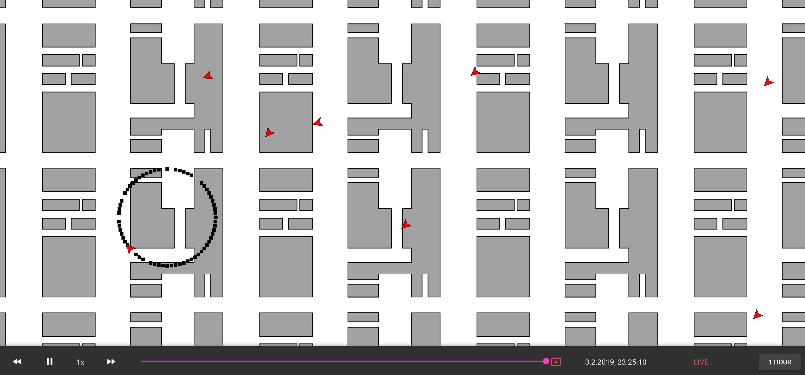
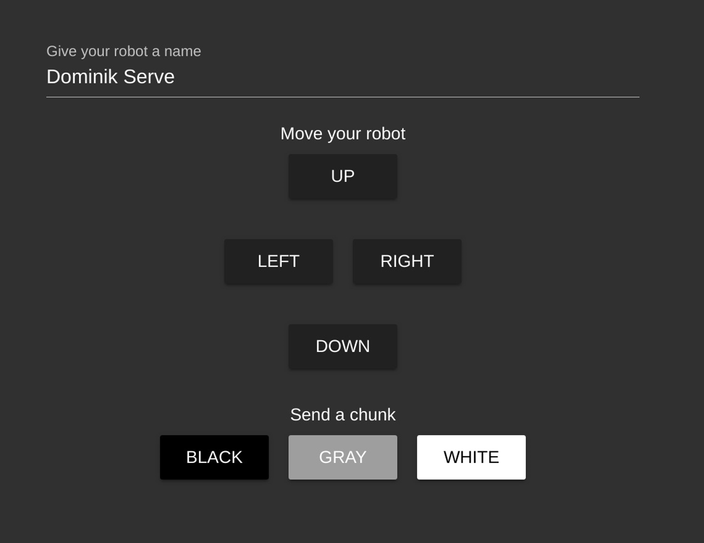

# Visualization

The visualization is the main new feature in this project. It allows to review the map's history and also the robot movements.



## Robot Controller

The visualization also comes with a UI to control your own robot. Therefore, browse to `/controller` to see the following interface.

<div align="center">
    
</div>

## Project setup

* Install required npm packages
    ```
    npm install
    ```

* Run it locally on port 8080 (hot-reloads changes)
    ```
    npm run serve
    ```

* Compile and minify for production
    ```
    npm run build
    ```

* Run your tests
    ```
    npm run test
    ```

* Lint and fix files
    ```
    npm run lint
    ```

## Configuration

#### Customize vue js

See [Configuration Reference](https://cli.vuejs.org/config/).

#### Customize api urls

You have three possibilities to configure the ip addresses and ports of the api.

1. **Environment variables:** Set the `API_URL = 'http://ip-address:port'` and the `MQTT_URL = 'localhost:9001/mqtt'` variables
2. **Config file:** add a file named `config.js` to the `visualization` folder. This file should look like this
    ```json
    {
        "API_URL": "http://localhost:8081",
        "MQTT_URL": "localhost:9001/mqtt"
    }
    ```
3. **Do nothing:** If neither of the above configurations applies, the defaults will be used: `API_URL = 'http://localhost:8081'` and the `MQTT_URL = 'localhost:9001/mqtt'`

## Development

For the dev config have a look at the README [here](dev-config/README.md).
